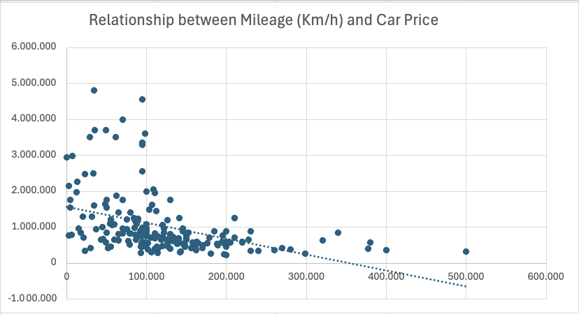
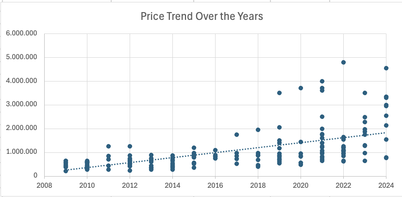

# Used Car Price Analysis (MIS 311 - Assignment #1)

## Project Overview
This project is part of the **MIS 311 - Introduction to Business Analytics** course (Assignment #2: Personal Portfolio Site). The primary objective is to analyze a dataset of used cars (`09_Used Car Price`) using Excel to uncover key statistics, understand market trends, and present the findings professionally.

---
## 1. Dataset Description

The dataset contains used car listing records collected for price analysis. Each row represents one vehicle listing. The original dataset consisted of **202 rows** and **7 columns**. After data cleaning and preprocessing, the final dataset was prepared for exploratory data analysis and visualization.

The dataset includes the following variables:

- **Model**: Name or model of the vehicle  
- **Year**: Manufacturing year of the car  
- **Km/h**: Total distance driven by the vehicle (mileage)  
- **Color**: Exterior color of the car  
- **Type**: Transmission type of the vehicle (Automatic or Manual)  
- **Fuel**: Fuel type used by the vehicle  
- **Price**: Selling price of the used car  

In this dataset, the **Price** variable represents the selling price of each vehicle and was used as the primary variable for analyzing market trends, vehicle value distribution, and the relationship between mileage, manufacturing year, and car prices.

---

## 2. Data Cleaning & Preparation

To ensure high data integrity and prevent any biased calculations before conducting the statistical analysis, the dataset was cleaned directly in Excel through the following steps:

* **Handling Missing Values (Complete-Case Analysis):**
  * A thorough inspection was conducted across all columns using Excel's **Filter** and **Conditional Formatting** to identify missing or null values.
  * Incomplete records—specifically rows with missing values in columns like `Fuel`—were **completely removed (deleted)** from the dataset. This strict filtering approach ensures that the subsequent analysis is based purely on complete, verified records, avoiding any arbitrary guesswork.
* **Removing Duplicates:**
  * To prevent data redundancy and avoid skewed statistical results, Excel's **Remove Duplicates** tool was applied across the entire table.
  * This eliminated recurring rows, ensuring that each remaining car record represents a unique, distinct market entry.

---

##  3. Descriptive Statistics

Following the data cleaning process, a comprehensive Descriptive Statistics analysis was performed in Excel on the final sample size of **187 observations**, focusing on three main numerical variables: `Year`, `Km/h` (Mileage), and `Price`.

###  Manufacturing Year
* **Mean & Median:** The average manufacturing year of the cars is **2016**, while the median year is **2017**. This indicates that the majority of vehicles available in this dataset are relatively modern.
* **Distribution:** The skewness value is close to zero (**-0.046**), which strictly suggests that the distribution of car manufacturing years is approximately symmetrical across the timeline (2009 to 2024).

### Mileage (Km/h)
* **Mean & Median:** The average distance driven is approximately **119,158 km**, whereas the median is **102,000 km**.
* **Variance & Distribution:** The large standard deviation (**78,446 km**) highlights a substantial variation in vehicle usage among the cars. The mileage distribution is positively skewed (**1.50**), meaning that while a significant portion of cars have moderate mileage, a smaller group of vehicles with exceptionally high mileage pulls the overall average upward.

### Car Price
* **Mean & Median:** The dataset shows a mean price of approximately **1,037,487**, while the median price sits lower at **750,000**. The noticeable gap between the mean and median highlights the heavy economic impact of premium vehicles in the sample.
* **Shape & Range:** The price distribution is strongly positively skewed (**2.22**) with a high kurtosis (**4.93**), mathematically confirming the existence of extreme high-price values and heavy-tailed outliers. The market prices span widely from a minimum of **220,000** to a maximum of **4,800,000**.

---

## 4. Key Analytical Insights

Based on the scatter plot analysis (2009–2024), here are the main takeaways:

* **Long-term Upward Trend**: Product prices exhibit a consistent upward trajectory over the 15-year period.
* **Market Diversification (Post-2019)**: Prior to 2019, prices were highly concentrated below 1.5M. Post-2019, the price variance expanded significantly, indicating the introduction of premium segments (ranging up to 5.0M).
* **Market Peak (2021-2022)**: Data density peaked in 2021, and the highest historical price point was recorded in 2022 (approaching 5.0M).
* **Stabilization (2023-2024)**: Recent years show a lower volume of data points, but the price baseline remains high, stabilizing between 1.0M and 4.5M.

Based on the scatter plot analyzing the relationship between Mileage and Car Price, here are the main takeaways:

* **Negative Correlation**: There is a clear downward trend (as shown by the dotted trendline), meaning car prices decrease as mileage increases.
* **High-Value Concentration (Low Mileage)**: Cars with mileage under 100,000 Km show the highest price variance, with premium vehicles peaking between 3.0M and 5.0M.
* **Price Stabilization (High Mileage)**: Once a car passes 200,000 Km, its value drops significantly and stabilizes at a low baseline (mostly under 1.0M), regardless of further mileage accumulation.
* **Outliers**: A few cars with high mileage (around 300,000 - 500,000 Km) still maintain a relatively higher price than expected, likely due to specific models, conditions, or maintenance history.

---

##  5. Visualizations

To visually investigate the market dynamics, two primary charts were generated to analyze how mileage and manufacturing year heavily influence the final resale price of the vehicles:

| Chart 1: Price vs. Mileage | Chart 2: Price vs. Year |
| :---: | :---: |
|  |  |
| *Scatter plot illustrating the downward price trend as mileage increases.* | *Trend analysis demonstrating vehicle value growth over manufacturing years.* |

---

##  6. Submission Details
* **Name:** Hà Phương
* **IRN:** 2232300245
* **Course:** MIS 311 - Introduction to Business Analytics
* **Assessment:** Assignment #2: Personal Portfolio Site

